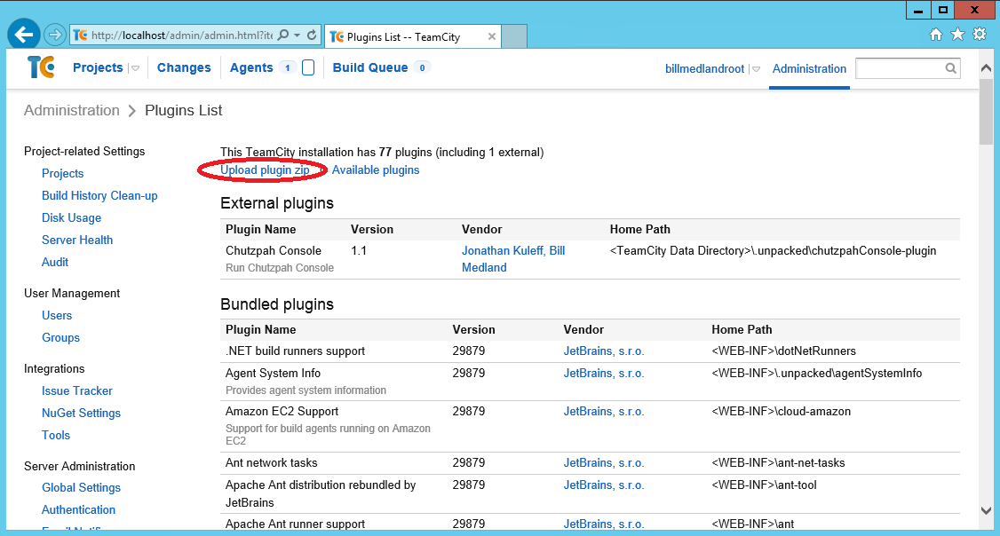
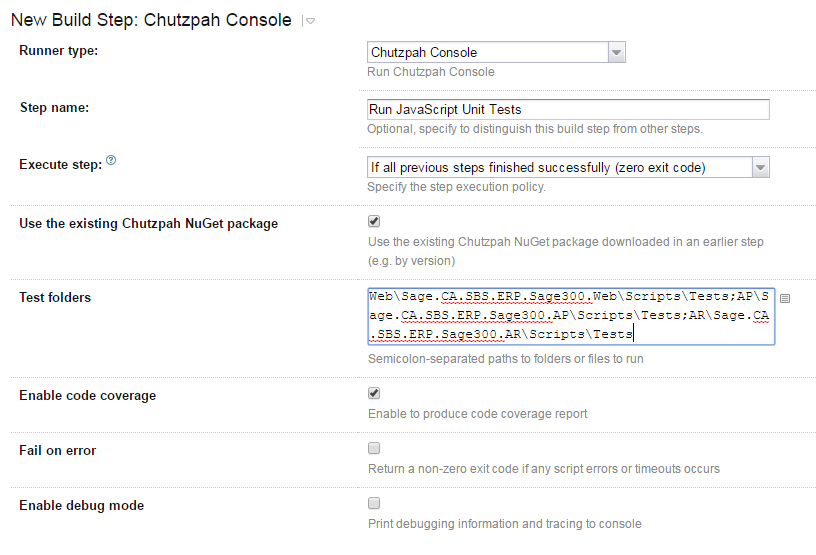
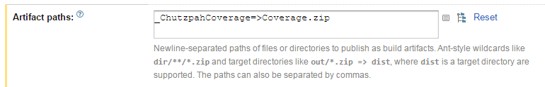

# TeamCity Chutzpah Meta-Runner
TeamCity meta-runner for the Chutzpah Console JavaScript test runner. Does not require Chutzpah to be pre-installed on agents as the runner can automatically download the latest
Chutzpah Console NuGet package.

## How to use

### Installing plugin in TeamCity
Copy the plugin zip (ChutzpahConsole-plugin.zip) into the main TeamCity plugins directory, located at _**\<TeamCity Data Directory>**/plugins_. 
It will automatically get unpacked into the Build Agent Tools folder located at _**\<TeamCity Home>**/buildAgent/tools_.

If you are not sure where the home or data directories are located you can find them in the Administration section of TeamCity.

Alternatively use the 'Upload Plugin Zip' option in the TeamCity Administration Plugins page:


### Added Meta-Runner to Build Configuration

Once the plugin has unpacked you should see _Chutzpah Console_ as an option when you add a new build step in your build configuration. Test folders is the only manadatory field 
and each of the semicolon-separated values should match the -path parameter for the chutzpah console exe.



### Set Up Code Coverage Tab
If you select 'Enable code coverage' then coverage will be calculated and automatically added (as line coverage) to the Run overview tab.

If you want to have the coverage results as another tab on the build results page, add an artifact to match the built-in TeamCity rule.

For each project that is doing code coverage add the following line to the artifacts tab: '_ChutzpahCoverage=>coverage.zip'


## How to build the plugin

Building the plugin requires PowerShell 5.0

Run build-plugin.ps1 from root folder and the plugin will be created in _**./.artifacts**_ as ChutzpahConsole-plugin.zip 
````PowerShell
PS c:\source\teamcity-chutzpah-meta-runner>.\build-plugin.ps1
````

